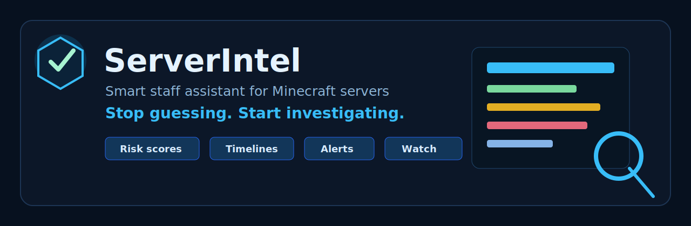
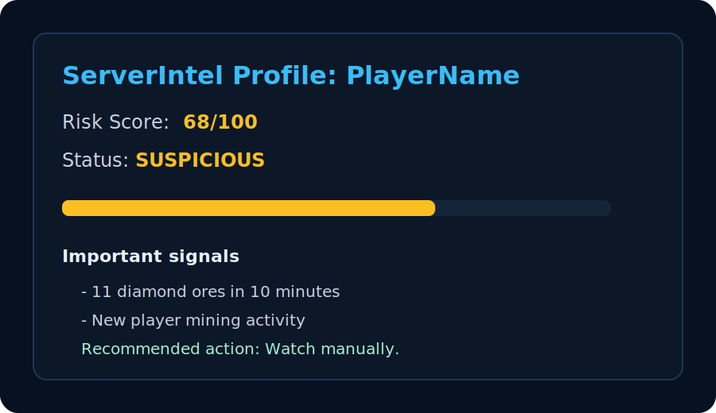
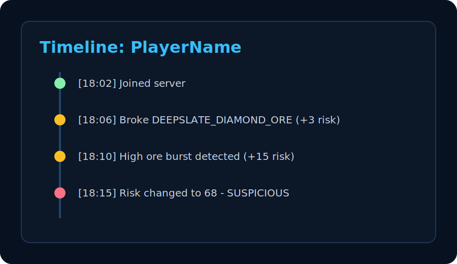
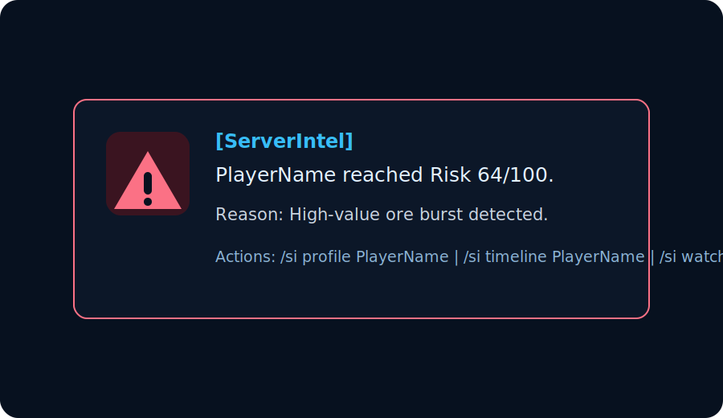
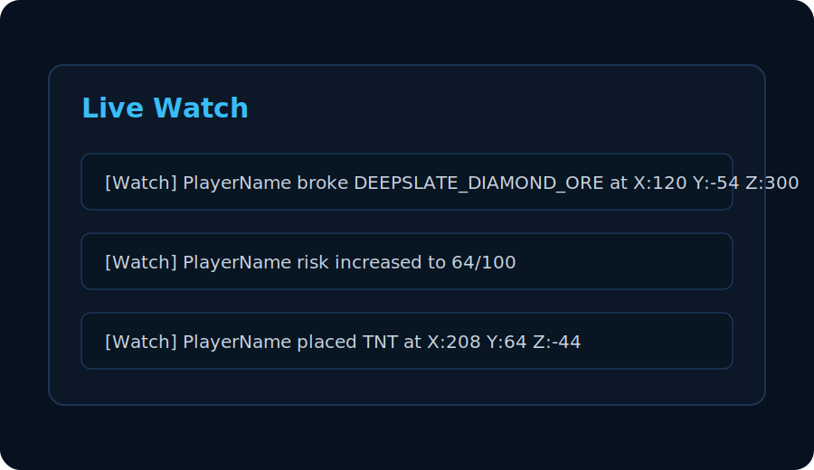

# ServerIntel

[](https://github.com/betminekdev/ServerIntel/actions/workflows/build.yml)


Smart staff assistant for Minecraft servers.

**Stop guessing. Start investigating.**

ServerIntel helps staff teams understand suspicious player behavior using risk scores, player timelines, smart alerts, and investigation-focused data.

> **Beta warning:** ServerIntel `v0.1.0-beta` is an early public beta. Test it on a staging server first and tune thresholds for your community.

ServerIntel is not a classic anti-cheat and does not replace human moderation. It provides server-side signals and evidence timelines to help staff make better decisions. It does not auto-ban players and it does not claim guaranteed cheat detection.

## Features

- Player risk score from `0` to `100`.
- Clear risk levels: `SAFE`, `WATCH`, `SUSPICIOUS`, `HIGH_RISK`.
- Persistent player timeline with important actions.
- Suspicious mining signals for valuable ores and ore bursts.
- Staff alerts with cooldowns.
- In-memory watch mode for live staff investigation.
- SQLite storage.
- Configurable risk values, thresholds, and decay.
- Permission-based command access.
- Prepared architecture for future evidence reports.

## Preview

| Profile | Timeline |
| --- | --- |
|  |  |

| Alert | Watch |
| --- | --- |
|  |  |

## Installation

1. Download `ServerIntel-0.1.0-beta.jar` from the GitHub release.
2. Put the JAR into your server `plugins` folder.
3. Start the server.
4. Edit `plugins/ServerIntel/config.yml` if needed.
5. Run `/si reload` after configuration changes.

## Commands

Main command: `/serverintel`  
Preferred command: `/si`  
Aliases: `/si`, `/smartadmin`, `/sa`

| Command | Description |
| --- | --- |
| `/si help` | Shows ServerIntel commands. |
| `/si profile <player>` | Shows player risk score, status, and recent signals. |
| `/si timeline <player>` | Shows recent important actions. |
| `/si watch <player>` | Toggles live watch mode for the sender. |
| `/si alerts` | Toggles personal staff alerts. |
| `/si reload` | Reloads configuration. |
| `/si version` | Shows plugin version. |
| `/si evidence <player>` | Prepared placeholder for future investigation summaries. |

More detail: [docs/commands.md](docs/commands.md)

## Permissions

| Permission | Description | Default |
| --- | --- | --- |
| `serverintel.admin` | Full access. | op |
| `serverintel.staff` | Can use profile, timeline, watch, and alerts. | op |
| `serverintel.reload` | Can reload config. | op |
| `serverintel.alerts` | Can receive staff alerts. | op |
| `serverintel.bypass` | Excludes a player from risk scoring unless configured otherwise. | false |

More detail: [docs/permissions.md](docs/permissions.md)

## Configuration Preview

```yaml
risk:
  max-score: 100
  decay-enabled: true
  decay-amount: 2
  decay-interval-minutes: 30

mining:
  enabled: true
  valuable-ores:
    DIAMOND_ORE: 3
    DEEPSLATE_DIAMOND_ORE: 3
    ANCIENT_DEBRIS: 5
    EMERALD_ORE: 2
    DEEPSLATE_EMERALD_ORE: 2
  burst-detection:
    enabled: true
    time-window-minutes: 10
    diamond-threshold: 10
    ancient-debris-threshold: 6
    extra-risk: 15

alerts:
  enabled: true
  threshold: 60
  high-risk-threshold: 80
  cooldown-seconds: 30
```

More detail: [docs/configuration.md](docs/configuration.md)

## Risk Levels

| Score | Level | Meaning |
| --- | --- | --- |
| `0-25` | `SAFE` | No major current concern. |
| `26-50` | `WATCH` | Worth keeping an eye on. |
| `51-75` | `SUSPICIOUS` | Review timeline and watch manually. |
| `76-100` | `HIGH_RISK` | Strong review priority, still not proof. |

## Example Alert

```text
[ServerIntel] PlayerName reached Risk 64/100.
Reason: High-value ore burst detected.
Actions: /si profile PlayerName | /si timeline PlayerName | /si watch PlayerName
```

## Example Timeline

```text
[18:02] Joined server
[18:06] Broke DEEPSLATE_DIAMOND_ORE at world - X:120 Y:-54 Z:300 (+3 risk)
[18:10] High ore burst detected: 11 diamond ores in 10 minutes (+15 risk)
[18:15] Risk changed to 68 - Status: SUSPICIOUS
```

## Limitations

- ServerIntel does not detect cheat clients.
- ServerIntel does not provide 100% xray detection.
- ServerIntel does not inspect screenshots or client-side state.
- ServerIntel does not auto-punish players.
- Risk scores are investigation signals, not proof.
- Watch mode is in-memory and resets on restart.
- SQLite writes are simple and synchronous in v0.1.

More detail: [docs/detection.md](docs/detection.md)

## Build

```powershell
.\gradlew.bat clean build --console plain
```

The JAR is created at:

```text
build/libs/ServerIntel-0.1.0-beta.jar
```

## Roadmap

- Discord webhook alerts.
- Full evidence report generation.
- Inventory GUI.
- Web dashboard.
- More detectors.
- Chat risk detector improvements.
- Grief detector.
- Claim plugin integration.
- LuckPerms integration.
- PlaceholderAPI support.
- Export reports to JSON or text.
- Admin notes per player.

## Links

- GitHub: https://github.com/betminekdev/ServerIntel
- Modrinth: _coming soon_
- Hangar: _coming soon_
- SpigotMC: _coming soon_

## License

MIT License. See [LICENSE](LICENSE).
